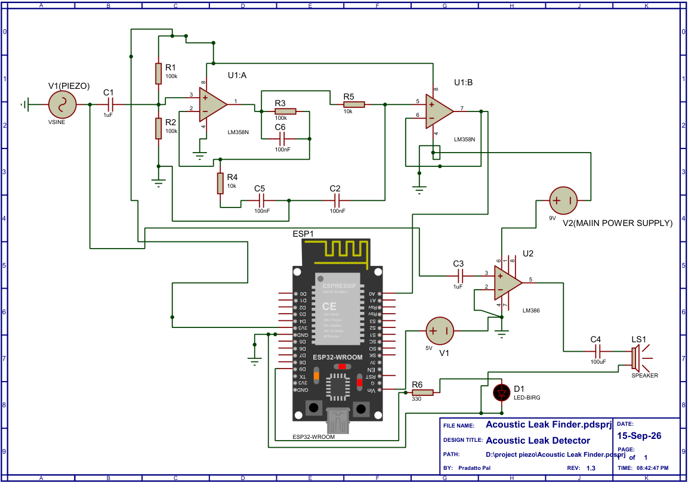

# Acoustic Leak Finder

An ESP32-based acoustic and vibration sensing system for detecting abnormal signals associated with possible water-pipe leaks.

## Requirements

- Arduino IDE 2.x
- ESP32 board support package for Arduino
- An ESP32 development board compatible with the firmware
- Piezoelectric contact sensor
- LM358L and required passive components
- Optional LM386 audio amplifier and headphones
- Arduino IDE 2.x LittleFS upload extension for uploading the `data/` directory


The system uses a piezoelectric contact sensor to capture mechanical vibrations from a pipe or surrounding structure. The signal is conditioned using an LM358L analog front-end and processed by an ESP32 to calculate signal RMS and dominant frequency.

A local Wi-Fi interface is included for viewing measurements from the ESP32. The interface is hosted directly by the ESP32 and is not required for the core sensing and signal-processing operation.

## Overview

Water leakage inside walls, floors, or buried pipelines can be difficult to locate without opening the structure or excavating the surrounding area.

Acoustic Leak Finder explores a non-invasive approach based on detecting vibration and acoustic signatures produced by pressurized water and possible leakage.

The prototype follows this signal-processing chain:

```text
Pipe / Structure
       |
       v
Piezoelectric Contact Sensor
       |
       v
LM358L Analog Signal Conditioning
       |
       v
ESP32 ADC
       |
       +--------------> RMS Measurement
       |
       +--------------> FFT Analysis
                              |
                              v
                       Dominant Frequency
                              |
                              v
                       Signal Classification
```

The ESP32 can also create its own local Wi-Fi access point and provide a dashboard for monitoring the measurements.

## Schematic



## Key Features

### Signal Acquisition

- Piezoelectric contact sensing
- Mechanical/acoustic vibration measurement
- Analog signal conditioning using LM358L
- ESP32 ADC acquisition

### Signal Processing

- RMS signal measurement
- FFT-based frequency analysis
- Dominant-frequency estimation
- Threshold-based signal classification
- Sampling at approximately 1000 Hz
- 128-point FFT
- FFT bin resolution of approximately 7.8125 Hz

### Local Monitoring

- ESP32-hosted local web interface
- No cloud service required
- No internet connection required
- No external web server required
- Wi-Fi access point created directly by the ESP32
- Real-time measurement display
- RMS and frequency monitoring
- Device status indication

## Hardware Architecture

```text
                 PIEZOELECTRIC SENSOR
                         |
              +----------+----------+
              |                     |
              v                     v
        LM358L ANALOG          LM386 AUDIO
        SIGNAL PATH             MONITORING
              |                     |
              v                     v
          ESP32 ADC              Headphones
              |
              v
       DIGITAL PROCESSING
              |
       +------+------+
       |             |
      RMS            FFT
       |             |
       |        Dominant Frequency
       |             |
       +------+------+
              |
        Classification
              |
              v
       Local Wi-Fi Interface
```

The LM386 branch can be used as an audio monitoring path so that the vibration signal can also be listened to through headphones during testing.

## Main Components

| Component | Purpose |
|---|---|
| ESP32 | Signal acquisition, processing and local interface |
| Piezoelectric disc/contact sensor | Detects mechanical vibration from the pipe/structure |
| LM358L | Analog signal amplification and conditioning |
| LM386 | Optional headphone/audio monitoring |
| Capacitors and resistors | Coupling, biasing, filtering and signal conditioning |
| 9 V battery | Analog/audio-side power during testing |
| USB/power source | ESP32 power |
| Headphones | Optional acoustic monitoring |
| LED indicator | Visual indication of the current firmware classification |

The exact hardware configuration may change as the prototype is refined.

## Analog Signal Conditioning

The piezoelectric sensor produces a relatively small AC signal.

The LM358L is used to condition and amplify this signal before it is sampled by the ESP32.

The analog stage uses a biased signal architecture so that the AC sensor signal can be processed within the ESP32 ADC voltage range.

A simplified representation is:

```text
Piezo
  |
  v
Coupling Capacitor
  |
  v
Bias / Signal Conditioning
  |
  v
LM358L Amplifier
  |
  v
Low-Pass Filtering
  |
  v
ESP32 ADC
```

The analog circuit is powered from the low-voltage ESP32-side supply, while the LM386 audio monitoring stage can be powered separately.

## Audio Monitoring

An LM386 is used as an optional headphone amplifier.

The audio branch is connected directly to the piezoelectric sensor rather than being cascaded from the LM358L processing path.

```text
                 +--> LM358L --> ESP32
Piezoelectric ---|
Sensor           +--> LM386 --> Headphones
```

This allows the operator to listen to the detected vibration while the ESP32 independently performs digital analysis.

The LM386 is used for audio monitoring only; it is not part of the ESP32 measurement path.

## Digital Signal Processing

The ESP32 samples the conditioned signal and performs basic digital signal analysis.

### RMS

RMS is used as a measure of the magnitude of the measured signal.

The RMS value is treated as a relative signal-level measurement for the prototype.

It is not currently calibrated to a physical acoustic unit such as dB.

### FFT

The ESP32 performs FFT analysis to estimate the dominant frequency present in the sampled signal.

Current prototype parameters:

```text
Sampling Rate:       1000 Hz
FFT Size:             128 samples
Frequency Resolution: 7.8125 Hz/bin
```

The theoretical frequency resolution is:

```text
1000 / 128 = 7.8125 Hz
```

Therefore, the reported dominant frequency is quantized according to the available FFT bins.

For example:

```text
Bin 0  = 0.000 Hz
Bin 1  = 7.8125 Hz
Bin 2  = 15.625 Hz
...
Bin 7  = 54.6875 Hz
```

This means a test signal around 54.7 Hz can appear close to the 54.69 Hz FFT bin.

## Signal Classification

The firmware uses the measured signal level to classify the current condition.

The prototype uses threshold-based classification rather than a trained machine-learning model.

Current classifications include:

```text
NORMAL
WARNING
LEAK DETECTED
```

The thresholds are defined in the firmware and can be adjusted during experimentation and calibration.

The classification should be considered a prototype indication, not a definitive diagnosis of a pipe leak.

## Local Wi-Fi Interface

The ESP32 can create a local Wi-Fi access point.

The device can be operated without:

- Internet access
- Cloud services
- A Wi-Fi router
- A PC running a server

The basic workflow is:

```text
Power ESP32
     |
     v
ESP32 starts
     |
     v
Creates local Wi-Fi network
     |
     v
Connect phone/computer
     |
     v
Open ESP32 local address
     |
     v
View live measurements
```

The dashboard is served directly from the ESP32's onboard filesystem.

The web interface is therefore a local device interface, not a separate web application requiring a computer server.

## Web Interface

The dashboard provides a convenient way to view measurements generated by the ESP32.

The interface can display:

- RMS value
- Dominant frequency
- Current classification
- Sensor state
- Wi-Fi state
- Sampling rate
- Recent measurement values

The dashboard communicates with the ESP32 locally.

No cloud backend is used.

## API

The ESP32 provides a local HTTP endpoint for current measurements:

```text
GET http://192.168.4.1/api/data
```

Example response:

```json
{
  "rms": 5.9,
  "frequency": 0.0,
  "status": "NORMAL",
  "wifi": true,
  "sensor": true,
  "samplingRate": 1000
}
```

### API Fields

| Field | Type | Description |
|---|---|---|
| `rms` | Number | Current relative RMS signal measurement |
| `frequency` | Number | Dominant frequency detected by the current FFT analysis |
| `status` | String | Current firmware classification |
| `wifi` | Boolean | Current Wi-Fi state |
| `sensor` | Boolean | Sensor/input state reported by the firmware |
| `samplingRate` | Integer | Current sampling rate in Hz |

The API is intended for local clients running on the same ESP32 access-point network. RMS values are relative prototype measurements and are not calibrated to dB or another physical acoustic unit.

## ESP32 Local Address

When operating as a local access point, the ESP32 can be accessed through:

```text
http://192.168.4.1
```

The measurement endpoint is:

```text
/api/data
```

Therefore:

```text
http://192.168.4.1/api/data
```

The exact network configuration is defined by the firmware.

## Firmware Dependencies

The firmware is written in Arduino/C++ for the ESP32.

The current implementation uses the following standard/framework components:

- `WiFi.h` — ESP32 Wi-Fi support
- `WebServer.h` — local HTTP server hosted by the ESP32
- `math.h` — mathematical functions used by the signal-processing code
- `string.h` — string utilities used by the firmware

The FFT implementation is included directly in the firmware rather than requiring an external FFT library.

No ArduinoJson dependency is required for the current `/api/data` response implementation.

If the firmware is changed to use additional external libraries, they should be added to this list and documented with their required versions.

## Firmware

The firmware is written for the ESP32 using Arduino/C++.

The firmware is responsible for:

1. Initializing the ADC
2. Acquiring sensor samples
3. Processing the sampled signal
4. Calculating RMS
5. Performing FFT analysis
6. Determining dominant frequency
7. Applying signal thresholds
8. Controlling the LED indicator output
9. Starting the local Wi-Fi access point
10. Serving the local interface
11. Providing measurement data to the dashboard

## Project Structure

```text
Acoustic-Leak-Finder/
|
+-- esp32/
|   +-- esp32_leak_finder/
|       +-- esp32_leak_finder.ino
|       +-- data/
|           +-- index.html
|           +-- script.js
|           +-- style.css
|
+-- LICENSE
+-- README.md
```

The firmware and web interface are maintained together because the web interface is intended to be served directly by the ESP32.

## Getting Started

### Hardware

Connect the prototype hardware according to the circuit used for the current revision.

The basic signal path is:

```text
Piezoelectric Sensor
        |
        v
     LM358L
        |
        v
   ESP32 ADC
```

For optional audio monitoring:

```text
Piezoelectric Sensor
        |
        v
      LM386
        |
        v
    Headphones
```

### Firmware

1. Install Arduino IDE 2.x.
2. Install the ESP32 board support package.
3. Open the firmware located in:

```text
esp32/esp32_leak_finder/
```

4. Select the appropriate ESP32 board.
5. Select the correct serial port.
6. Compile the firmware.
7. Upload it to the ESP32.

### Uploading the Web Interface

The web interface is stored in the firmware project's `data/` directory:

```text
esp32/esp32_leak_finder/data/
├── index.html
├── script.js
└── style.css
```

For Arduino IDE 2.x, use the **Arduino LittleFS Upload extension (`arduino-littlefs-upload`)** to upload the `data/` directory to the ESP32 filesystem.

The extension packages the contents of `data/` into a LittleFS filesystem image and uploads it to the ESP32. No Python web server is required.

### Wi-Fi Configuration

The ESP32 creates a local Wi-Fi access point. The SSID and password are configured in the firmware.

For local development, the credentials can be defined in the firmware in this form:

```cpp
const char* AP_SSID = "Acoustic-Leak-Finder";
const char* AP_PASSWORD = "YOUR_WIFI_PASSWORD";
```

**Do not commit a real Wi-Fi password or other private credentials to a public repository.** Use placeholder credentials in source code intended for publication and configure your actual credentials locally.

## Operating the Device

After the firmware has been uploaded:

1. Power the ESP32.
2. Allow the device to boot.
3. Connect a phone or computer to the ESP32's local Wi-Fi network.
4. Open:

```text
http://192.168.4.1
```

5. Place the piezoelectric sensor against the pipe or test structure.
6. Observe the measured RMS and dominant frequency.
7. Use the optional LM386 headphone output to listen to the detected vibration.

## Testing

The prototype has been tested using controlled signal sources as well as acoustic/vibration inputs.

A function-generator/test signal around 54.7 Hz has been used during signal-processing validation.

FFT results are expected to correspond to the nearest available FFT bin because the current system uses a 128-point FFT at a 1000 Hz sampling rate.

The prototype should therefore be evaluated using controlled test signals before attempting real-world leak detection.

## Limitations

This is an experimental prototype.

Current limitations include:

- No formal leak/no-leak dataset
- No machine-learning-based leak classification
- No calibrated acoustic measurement unit
- Dominant frequency is limited by FFT resolution
- Environmental and structural vibration can affect measurements
- Different pipe materials can produce different acoustic responses
- Pipe diameter, pressure, mounting position and sensor coupling can affect the measured signal
- A vibration signal alone does not prove that a leak is present
- Reliable leak localization has not yet been implemented
- Field validation is still required

The current system should therefore be considered a prototype acoustic/vibration measurement and leak-indication platform, rather than a finished commercial leak locator.

## Future Development

Possible improvements include:

- Sensor calibration
- Better analog filtering
- Improved noise rejection
- Automatic baseline measurement
- More robust leak/no-leak classification
- Multiple piezoelectric sensors
- Cross-correlation between sensors
- Leak-location estimation
- Different pipe-material testing
- Wall-embedded pipe testing
- Buried-pipe testing
- Long-term data logging
- Battery-powered operation
- Improved mechanical sensor coupling
- Machine-learning-based classification
- Field validation

## Research Direction

The long-term objective is to develop a compact, non-invasive system capable of detecting and eventually localizing water-pipe leaks using vibration and acoustic measurements.

The current prototype establishes the fundamental embedded signal-acquisition and processing pipeline:

```text
Mechanical Vibration
        |
        v
Piezoelectric Sensing
        |
        v
Analog Conditioning
        |
        v
ESP32 Acquisition
        |
        v
RMS + FFT
        |
        v
Signal Classification
```

Further experimental work is required to establish reliable relationships between measured acoustic features and actual leak conditions.

## Current Status

**Project Type:** Experimental hardware prototype  
**Platform:** ESP32  
**Primary Sensor:** Piezoelectric contact sensor  
**Analog Front-End:** LM358L  
**Optional Audio Amplifier:** LM386  
**Sampling Rate:** 1000 Hz  
**FFT Size:** 128 samples  
**FFT Resolution:** 7.8125 Hz/bin  
**Monitoring:** Local ESP32-hosted interface  
**Internet Required:** No  
**Cloud Services:** None  

The project is currently focused on validating acoustic/vibration sensing, signal conditioning, embedded signal processing and real-world leak detection experiments.

## Contributing

Suggestions, bug reports, hardware improvements, signal-processing experiments, and software improvements are welcome.

For substantial changes, open an issue first to discuss the proposed change. Pull requests are welcome for improvements that are relevant to the project.

## License

This project is licensed under the MIT License.

See the `LICENSE` file for details.
